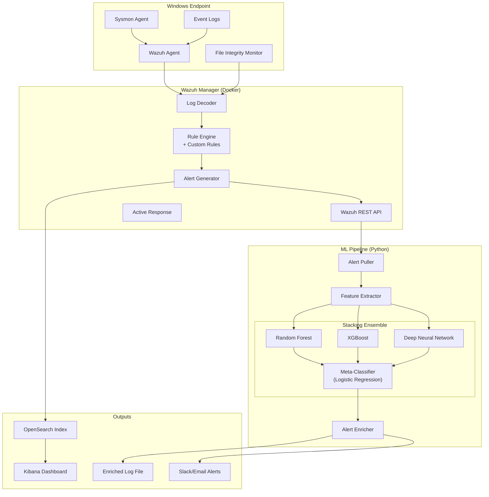

# System Architecture

## High-Level Architecture



## Data Flow

```
                    ┌─ Event Logs ─┐
  Windows Host ───▸ │  + Sysmon    │ ───▸ Wazuh Agent ───▸ Wazuh Manager
                    │  + FIM       │           │
                    └──────────────┘           ▼
                                        Rule Analysis
                                              │
                                    ┌─────────▼──────────┐
                                    │  JSON Alerts (API)  │
                                    └─────────┬──────────┘
                                              │
                              ┌───────────────▼───────────────┐
                              │    Feature Extraction          │
                              │    (76 CIC-IDS2017 features)   │
                              └───────────────┬───────────────┘
                                              │
                         ┌────────────────────┼────────────────────┐
                         ▼                    ▼                    ▼
                  ┌──────────────┐   ┌──────────────┐   ┌──────────────┐
                  │ Random Forest│   │   XGBoost    │   │     DNN      │
                  │  (Known      │   │  (Precision  │   │  (Anomaly    │
                  │   attacks)   │   │   boost)     │   │   detection) │
                  └──────┬───────┘   └──────┬───────┘   └──────┬───────┘
                         │                  │                   │
                         └──────────────────┼───────────────────┘
                                            ▼
                                   ┌────────────────┐
                                   │ Stacking Meta  │
                                   │ Classifier     │
                                   │ (Log. Regr.)   │
                                   └───────┬────────┘
                                           ▼
                                   Final Classification
                                   + Confidence Score
```

## Component Details

### 1. Telemetry Collection
- **Sysmon**: Process creation, network connections, file/registry changes, DNS queries
- **Wazuh Agent**: Collects Sysmon + Security Event Logs + FIM data
- **Coverage**: 12 Sysmon event types + Windows Security events

### 2. Wazuh Rule Engine
- **Built-in rules**: ~3500 rules for general threat detection
- **Custom rules**: 20 rules (ID 100100-100171) for Windows-specific threats
- **MITRE ATT&CK mapping**: All custom rules mapped to techniques
- **Categories**: PowerShell abuse, RDP brute-force, credential dumping, persistence, ransomware, defense evasion

### 3. ML Ensemble Architecture

| Model | Role | Strengths |
|-------|------|-----------|
| **Random Forest** | Known attack classification | Robust, handles class imbalance, feature importance |
| **XGBoost** | High-precision classification | Superior with tabular data, regularization |
| **DNN** (128→64→32) | Anomaly/unknown detection | Pattern recognition in high-dimensional space |
| **Logistic Regression** | Meta-classifier (stacking) | Combines base models, calibrated probabilities |

### 4. Classification Taxonomy

| Class | ID | Description | Examples |
|-------|----|-------------|----------|
| Normal | 0 | Benign traffic | Regular HTTP, DNS, system events |
| DoS | 1 | Denial of Service | Hulk, GoldenEye, Slowloris, DDoS |
| Probe | 2 | Reconnaissance | Port scanning, SSH/FTP brute-force |
| R2L | 3 | Remote-to-Local | Web attacks, SQL injection, XSS |
| U2R | 4 | User-to-Root | Bot activity, privilege escalation |

### 5. Periodic Processing
- **Interval**: Configurable (default 30s, range 15-60s)
- **Batch processing**: Low overhead vs. real-time stream processing
- **Pipeline**: Pull alerts → Extract features → Parallel inference → Stack → Enrich → Output

## Technology Justifications

| Choice | Rationale |
|--------|-----------|
| **Wazuh** | Free, open-source SIEM with native Windows support and rich API |
| **Docker** | Reproducible deployment, easy teardown for academic use |
| **Sysmon** | Deep Windows telemetry without kernel driver development |
| **scikit-learn + XGBoost** | Industry-standard, well-documented, efficient with tabular data |
| **TensorFlow/Keras** | Production-quality DNN framework, GPU support if needed |
| **Stacking ensemble** | Proven to outperform individual models, reduces variance |
| **CIC-IDS2017** | Standard benchmark dataset for IDS research, labeled multi-class |
